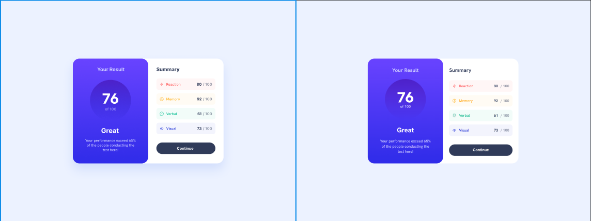

# Versões

#Versão 1.0.0  
-> Início do Projeto

#Versão 1.1.0  
-> Adição do Read.me  
-> Inclusão do padrão do HTML  

#Versão 1.2.0  
-> Correção no Read.me  
-> Criando HTML da parte superior

#Versão 1.3.0  
-> Adição do estilo da parte superior

#Versão 1.3.1  
-> Atualizando o readme que esqueci kkkk  

#Versão 1.4.0  
-> Adicionando HTML parte inferior  

#Versão 1.4.1  
-> Corrigindo erro no read.me  

#Versão 1.5.0  
-> Iniciando estilização da parte inferior  

#Versão 1.6.0  
-> Finalizando o Mobile  

#Versão 1.6.1  
-> Atualizando Read-me  

#Versão 1.6.2  
-> Iniciando o desktop  

#Versão 1.7.0  
-> Finalizando o Projeto  

# NOTA

Este projeto foi feito com o intuito de refinar minhas habilidades de frontend.   

Caso queira ver o projeto, aqui está o link do deploy: https://gabrielestefono.github.io/pagina_sumario_vanilla/  

A ideia foi manter o mais próximo possível do original, e aqui está uma comparação lado a lado, onde a esquerda é o original e à direita o que fiz:  

